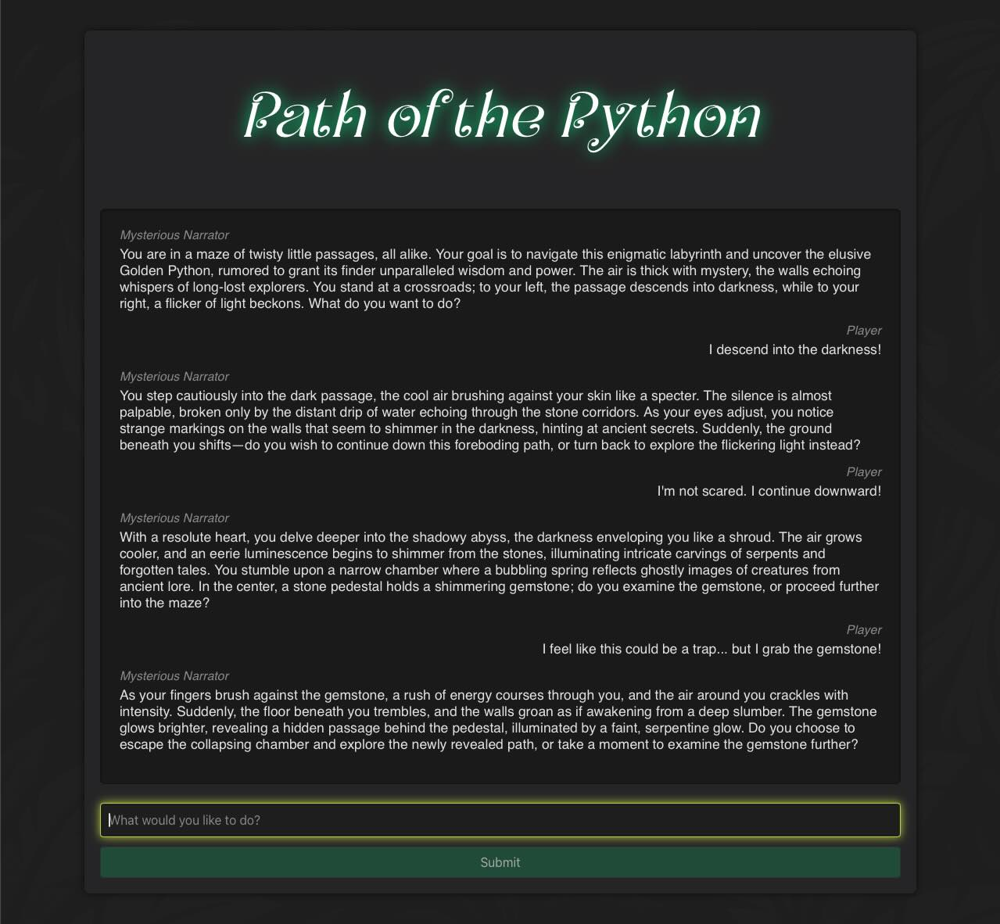

# Path of the Python

A text-based adventure game similar to Colossal Cave Adventure, but based on AI.

The goal is to explore the following technologies:

- Python
- FastAPI
- React
- AI integration



## Run locally

```
docker-compose up --build

Navigate to http://localhost:8002
```

## Backend

```
# Lint

docker compose run backend ruff check .
```

```
# Test

docker compose run -e AVOID_OPENAI_CALLS=false backend pytest
```

## Frontend

```
# Lint

docker compose run frontend npm run lint
```

```
# Test

docker compose run frontend npm run test
```
